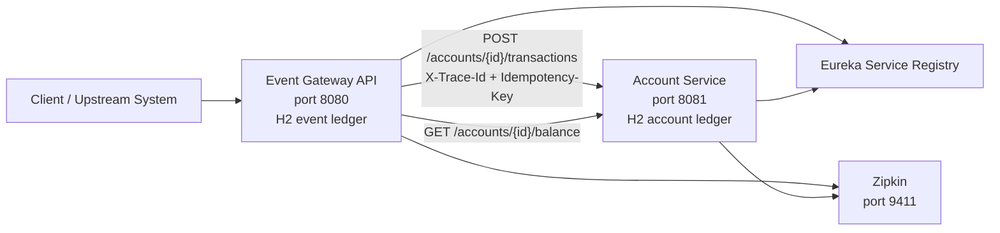
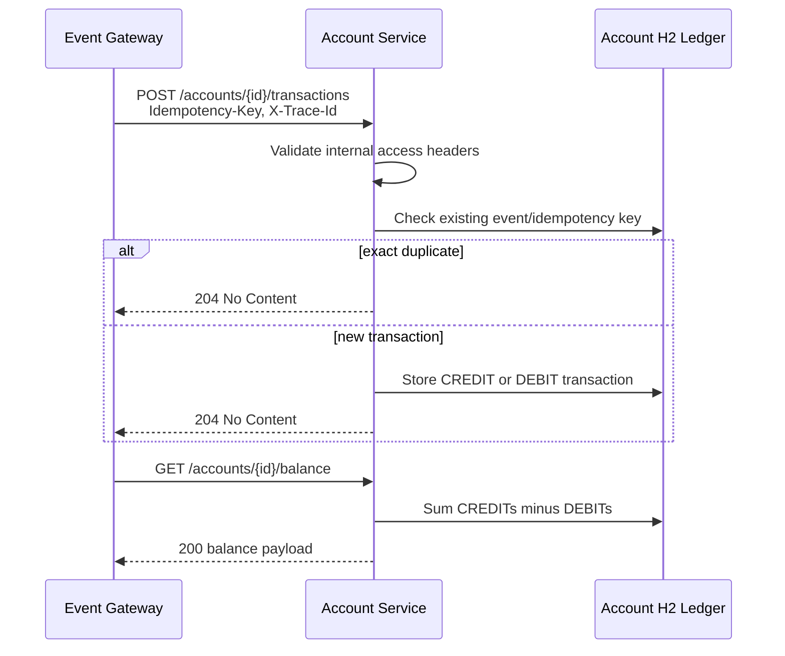

# Account Service

Spring Boot Account Service skeleton aligned with the sibling Event Gateway API.

## Architecture Overview

Account Service is the downstream account-domain service used by Event Gateway.
It owns transaction application, idempotent transaction storage, account detail
projection, and balance computation. Event Gateway owns public event ingestion
and resiliency around remote calls to this service.





### Design Choices

- Balance computation lives only in Account Service so account-domain rules are not duplicated in Gateway.
- The service stores transactions idempotently using the upstream `eventId` and `Idempotency-Key`, allowing Gateway retries without double-applying money movement.
- H2 is embedded/in-memory for the POC so Account Service can run independently without sharing state with Gateway.
- Account endpoints require POC internal headers from Gateway. This is not production security, but it documents and enforces the intended service boundary locally.
- Account Service does not implement circuit breakers around local ledger operations. Resiliency patterns belong in Gateway because Gateway is the remote caller.
- Incoming `X-Trace-Id` mirrors the active Micrometer/Zipkin trace id and is written as `appTraceId` so Account Service log lines, Gateway log lines, response headers, and Zipkin use the same trace id for one request.

## Baseline Stack

- Java 21
- Spring Boot 4.0.6
- Spring Cloud 2025.1.1 with Netflix Eureka client
- Zipkin tracing through Spring Boot Actuator and Micrometer tracing
- Docker deployment
- Lombok
- Apache Commons Collections
- Hikari connection pooling through Spring Boot datasource auto-configuration
- H2 in-memory database
- Cucumber acceptance tests through the JUnit Platform
- Pact provider verification for the Event Gateway consumer contract

## API

- `POST /accounts/{accountId}/transactions` applies a CREDIT or DEBIT transaction sent by Event Gateway and returns `204 No Content` when accepted.
- `GET /accounts/{accountId}/balance` returns the raw computed balance payload consumed by Event Gateway.
- `GET /accounts/{accountId}` returns raw account details and recent transactions.
- `GET /health` and `GET /healthcheck` return the public service health response.
- `GET /actuator/health` returns runtime health details.
- `GET /h2-console` opens the development H2 console.

## Setup and Startup

Prerequisites:

- Java 21 JDK
- Maven 3.9+
- Docker Desktop, only if using the per-service Docker Compose file
- A Eureka-compatible service registry running on `http://localhost:8761`
- Event Gateway running on `http://localhost:8080` for full local system testing
- Optional Zipkin on `http://localhost:9411` for trace visualization

Recommended local startup order:

1. Start the service registry first. Both Gateway and Account Service register with Eureka.
2. Start Event Gateway second. Gateway is the public boundary and can safely start before Account Service because it degrades `POST /events` to durable `202 Accepted` responses while Account Service is unavailable.
3. Start Account Service third. After it registers as `account-service`, Gateway can discover it and route apply/balance calls to it.

Manual startup from separate terminals:

```powershell
# Terminal 1: service registry
# Start your Eureka server so it is available at http://localhost:8761
```

```powershell
# Terminal 2: Event Gateway
cd C:\Users\pravi\IdeaProjects\EventGatewayService\EventGatewayService
$env:EUREKA_DEFAULT_ZONE = "http://localhost:8761/eureka/"
$env:ACCOUNT_SERVICE_DEFAULT_URL = "http://localhost:8081"
mvn spring-boot:run
```

```powershell
# Terminal 3: Account Service
cd C:\Users\pravi\IdeaProjects\EventGatewayService\AccountSvc
$env:EUREKA_DEFAULT_ZONE = "http://localhost:8761/eureka/"
$env:ACCOUNT_SERVICE_ALLOWED_CALLER = "event-gateway-api"
$env:ACCOUNT_SERVICE_INTERNAL_TOKEN = "local-dev-token"
mvn spring-boot:run
```

Health checks:

- Event Gateway: `GET http://localhost:8080/health`
- Account Service: `GET http://localhost:8081/health`
- Eureka: `GET http://localhost:8761`

## Event Gateway Contract

Transaction apply requests accept the same payload used by Event Gateway's `AccountServiceClient`:

```json
{
  "eventId": "9b63f0d4-0f49-4f85-9447-fd45a0c5b3c2",
  "type": "CREDIT",
  "amount": 150.00,
  "currency": "USD",
  "eventTimestamp": "2026-05-15T14:02:11Z",
  "metadata": {
    "source": "event-gateway"
  }
}
```

The endpoint also accepts `Idempotency-Key`; exact duplicate `eventId` calls are acknowledged with `204 No Content` without re-applying the transaction.

Provider-side Pact verification is documented in [docs/account-service-contract.md](docs/account-service-contract.md).

Run the provider contract test locally:

```powershell
mvn "-Dtest=AccountServicePactProviderTest" test
```

Regenerate the consumer pact in the sibling Event Gateway project:

```powershell
cd ..\EventGatewayService
mvn "-Dtest=AccountServicePactConsumerTest" test
Copy-Item target\pacts\event-gateway-api-account-service.json ..\AccountSvc\src\test\resources\pacts\event-gateway-api-account-service.json -Force
```

## POC Internal Access Guard

Account endpoints under `/accounts/**` require Event Gateway's shared POC
headers. Direct calls without these headers return `403 Forbidden` with code
`INTERNAL_ACCESS_DENIED`.

```powershell
$env:ACCOUNT_SERVICE_INTERNAL_CALLER_HEADER = "X-Internal-Caller"
$env:ACCOUNT_SERVICE_INTERNAL_TOKEN_HEADER = "X-Internal-Token"
$env:ACCOUNT_SERVICE_ALLOWED_CALLER = "event-gateway-api"
$env:ACCOUNT_SERVICE_INTERNAL_TOKEN = "local-dev-token"
```

Required request headers for local POC calls:

```http
X-Internal-Caller: event-gateway-api
X-Internal-Token: local-dev-token
```

This is intentionally a POC-only guard. Production should use network policy,
mTLS, OAuth2 client credentials, or a service mesh policy.

## Service Discovery

This service registers with Eureka using `spring.application.name=account-service`, matching Event Gateway's default `ACCOUNT_SERVICE_SERVICE_ID`.

Useful overrides:

```powershell
$env:EUREKA_DEFAULT_ZONE = "http://localhost:8761/eureka/"
$env:EUREKA_CLIENT_ENABLED = "true"
$env:EUREKA_REGISTER_WITH_EUREKA = "true"
$env:EUREKA_FETCH_REGISTRY = "true"
```

## Structured Logging and Tracing

Console logs use Spring Boot structured Logstash JSON format. Each log line includes stable `serviceName`, `traceId`, `spanId`, and `appTraceId` fields, matching Event Gateway's log contract. `traceId` is the Micrometer/Zipkin id; `appTraceId` mirrors `X-Trace-Id`.

Zipkin endpoint override:

```powershell
$env:ZIPKIN_ENDPOINT = "http://localhost:9411/api/v2/spans"
```

## Database Connection Pooling

Account Service is the downstream service for Event Gateway, so circuit
breakers belong on callers that make remote requests to this service. The local
ledger operations in this service are protected at the datasource boundary with
Hikari connection pooling.

Default pool settings:

```powershell
$env:ACCOUNT_SERVICE_DB_POOL_MAX_SIZE = "10"
$env:ACCOUNT_SERVICE_DB_POOL_MIN_IDLE = "2"
$env:ACCOUNT_SERVICE_DB_CONNECTION_TIMEOUT = "2000"
$env:ACCOUNT_SERVICE_DB_VALIDATION_TIMEOUT = "1000"
$env:ACCOUNT_SERVICE_DB_IDLE_TIMEOUT = "600000"
$env:ACCOUNT_SERVICE_DB_MAX_LIFETIME = "1800000"
$env:ACCOUNT_SERVICE_DB_LEAK_DETECTION_THRESHOLD = "0"
```

Use database pool metrics from Actuator `GET /actuator/metrics` to tune these
values for real workload and database capacity.

## Automated Tests

All Account Service tests run with the standard Maven lifecycle:

```powershell
mvn clean test
```

The suite includes:

- Core account functionality: idempotent transaction application, duplicate conflict detection, CREDIT/DEBIT signed balance calculation, account details, and validation.
- Controller behavior: transaction apply, balance read, account detail read, custom metrics, and health diagnostics.
- Internal access guard behavior: `/accounts/**` rejects missing Gateway headers while public health remains open.
- Trace propagation: incoming `X-Trace-Id` generation/echo behavior and logging MDC population.
- Contract verification: Pact provider tests verify the Event Gateway consumer contract against Account Service endpoints.
- Cucumber acceptance behavior: public health, healthcheck alias, valid transaction application, duplicate idempotency, validation failure, and balance after credit/debit transactions.

Run only the Cucumber acceptance suite:

```powershell
mvn -Dtest=RunCucumberAcceptanceTest test
```

Run only provider contract verification:

```powershell
mvn "-Dtest=AccountServicePactProviderTest" test
```

Cucumber reports are published under `target/cucumber-reports`.

## Docker

This repository keeps Docker Compose scoped to Account Service only. Event
Gateway has its own Docker Compose file in the sibling `EventGatewayService`
repository. Start the service registry first, then Event Gateway, then Account
Service.

```powershell
mvn clean package
docker compose up --build
```

## Observability

Console logs are emitted as JSON and include `timestamp`, `level`, `serviceName`, `traceId`, `spanId`, and `appTraceId`.
`X-Trace-Id` response headers mirror the active exported trace id. Callers that need to continue an existing distributed trace should send standard `traceparent` or B3 propagation headers.
`GET /health` returns public service status plus database connectivity diagnostics.
Actuator metrics are exposed under `/actuator/metrics`; accepted transactions increment the custom `account_service.transactions.applied` counter tagged by transaction type and result.

